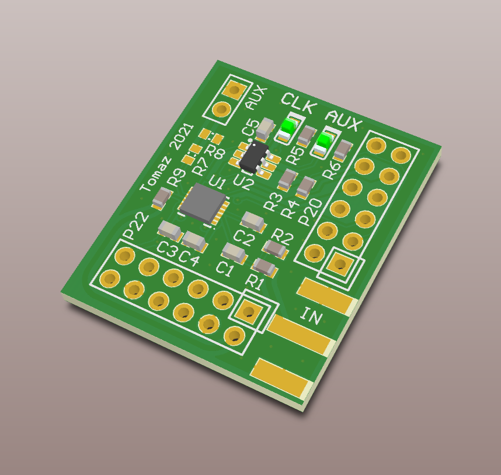
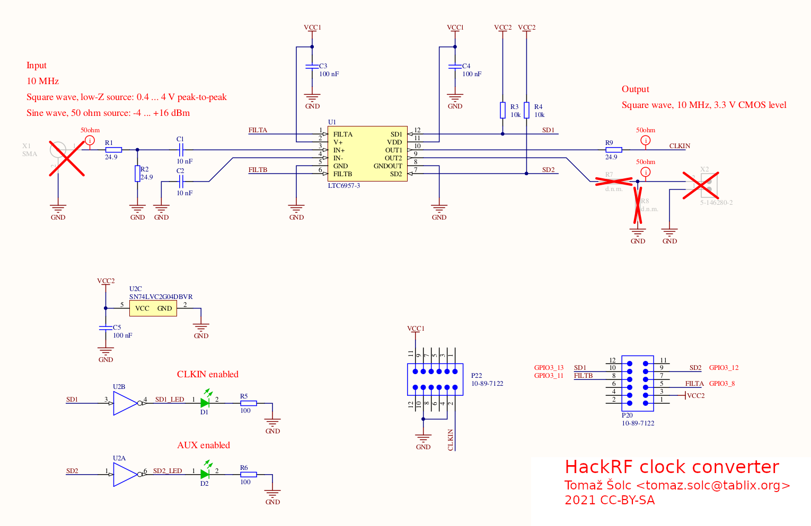

# HackRF clock converter

This circuit can be attached to an [HackRF
One](https://github.com/mossmann/hackrf/wiki/HackRF-One) to increase the range
of external clock signals that can be used on the CLKIN input.

An unmodified HackRF requires a 3.3V CMOS-level DC-coupled square wave for the
external clock reference. Using the clock converter modification, the CLKIN
input can be used with:

 * AC or DC coupled signals,
 * sine or square wave,
 * 0.4 to 4 V peak-to-peak amplitude (low-Z source),
 * -4 to +16 dBm level (50 ohm source)

The signal from the existing CLKIN connector can be routed to the clock
converter board by cutting a trace on the HackRF PCB and soldering a pair of
wires or a coax. Alternative is to place an additional SMA connector on the
clock converter board itself. This does not require any destructive
modifications of the HackRF, but is harder to fit into any existing enclosure
you might have.

This repository contains design files that you can use to make your own copy:

* Gerber and Excellon drill files for PCB manufacture,
* schematic and
* suggested bill of materials.

Clock converter is disabled by default. It is enabled and configured through
GPIO lines by running patched firmware and host tools. These are available from
the [avian2/hackrf fork](https://github.com/avian2/hackrf/).

For more details, see these blog posts:

* [HackRF clock converter](https://www.tablix.org/~avian/blog/archives/2021/06/hackrf_clock_converter/)
* [HackRF clock converter, 2](https://www.tablix.org/~avian/blog/archives/2021/06/hackrf_clock_converter_2/)
* [HackRF clock converter, 3](https://www.tablix.org/~avian/blog/archives/2021/06/hackrf_clock_converter_3/)

## License

hackrf-clock-conv was designed by Tomaž Šolc, based on the
[osmocom-clock-conv](https://osmocom.org/projects/osmo-clock-conv/wiki) by
Harald Welte and the Osmocom project.

The hackrf-clock-conv design is made available as Open Source Hardware (OSHW)
licensed under CC-BY-SA (Creative Commons Attribution Share-Alike).

This means anyone can use the design to build units, or to create derivative
versions of the design. However, you have to give attribution and release your
derivative works under the same license as the original project.
